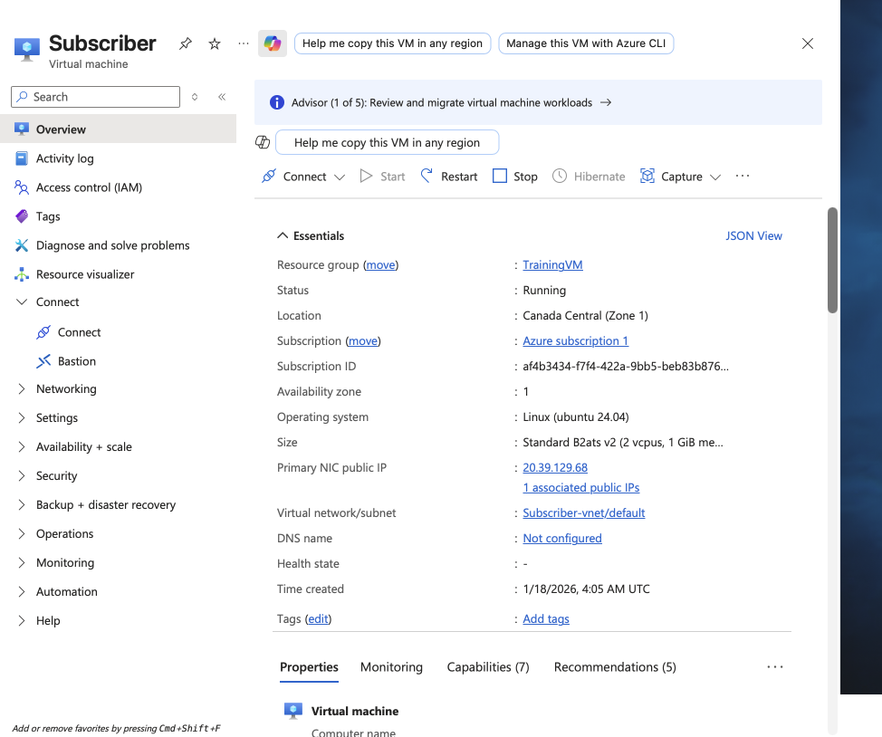
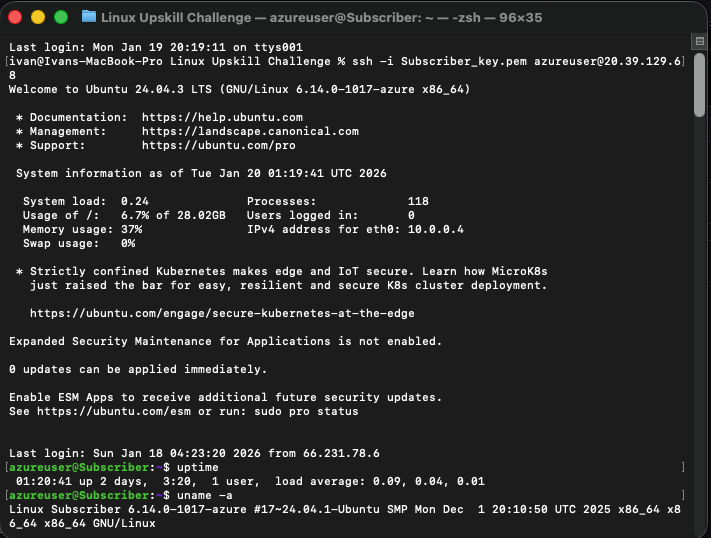

# Day 0. Linux Server Provisioning in Azure

## Objective
Provision a Linux virtual machine in the cloud and prepare it for remote Linux system administration.

## Platform and Operating System
- Cloud provider: Microsoft Azure
- Service: Azure Virtual Machine
- Operating system: Ubuntu Server 24.04 LTS
- Architecture: x64

## Environment Details
- vCPUs: 2
- Memory: 1 GiB RAM
- VM status: Running

## Environment Setup

### Virtual Machine Creation
- Created a new virtual machine in Azure.
- Selected the Ubuntu Server 24.04 LTS image.
- Chose a low cost VM size appropriate for learning.
- Deployed the VM in the Canada Central region.

### Authentication
- Configured SSH key based authentication.
- Password based login disabled by default.
- Private SSH key stored securely on the local machine.

### Remote Access
Connected to the server using SSH.

## Evidence

